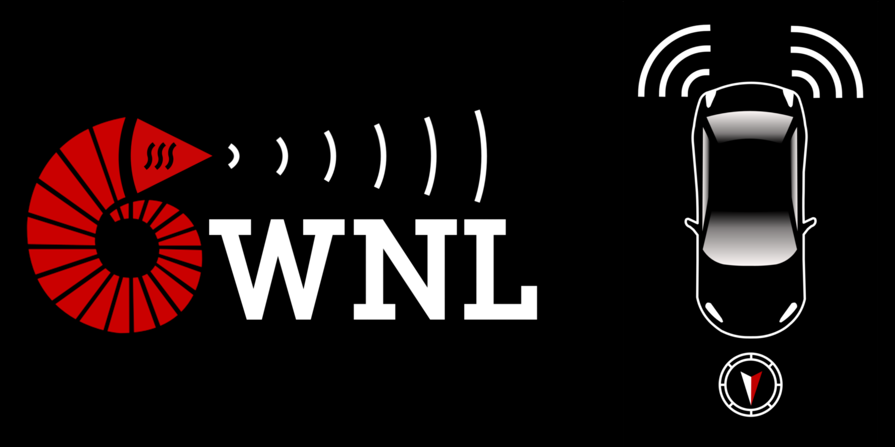

# Vehicular Visible Light Positioning (VLP) Simulations 

   
A Python-based simulator for vehicular visible light positioning (VLP) applications in collision avoidance and platooning scenarios. The simulator supports the following article under review:

	B. Soner, M. Karakas, U. Noyan, F. Sahbaz, S. Coleri, "Vehicular Visible Light Positioning for Collision Avoidance and Platooning: A Survey" 

as well as the following technical report

	B. Soner, S. Coleri, "Statistical Analysis of Geometric Algorithms in Vehicular Visible Light Positioning", arxiv pre-print: https://arxiv.org/pdf/2308.10641.pdf

## Overview

VLC channel simulation is radiometric and assumes LoS communication. VLC units are vehicle head/tail lights consisting of LED lights as transmitters and custom angle-of-arrival-sensing receivers, named QRX. The angle-of-arrival on the QRXs are calculated and are used for localization. Vehicle trajectories are either generated or recorded. Optical components are simulated with the [ray-optics library by mjhoptics](https://github.com/mjhoptics/ray-optics). See the [related discussion in ray-optics](https://github.com/mjhoptics/ray-optics/discussions/45) for more information on how the optical simulation works.

Currently, only the simulations in the article are presented here. Notebooks starting with "survey" are for the paper under review, and those starting with "report" are for the technical report.